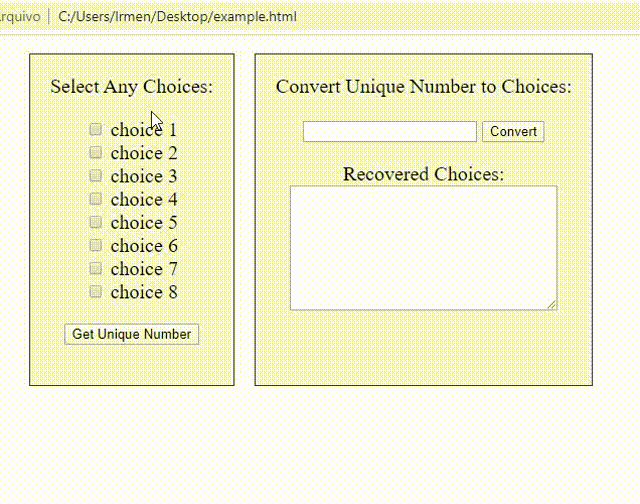
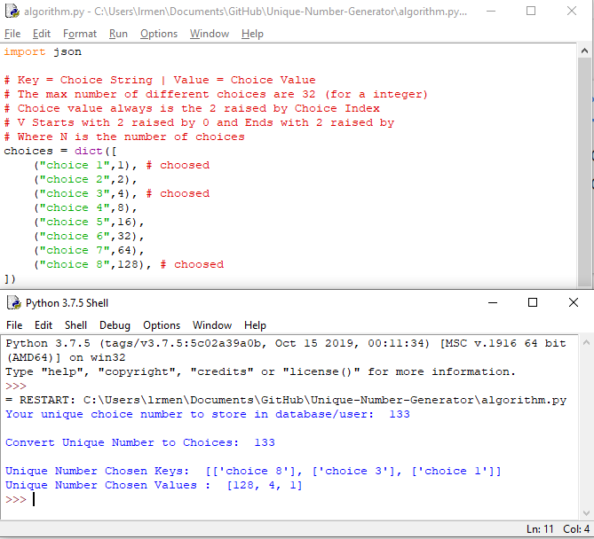

### The Algorithm
It is a simple recursive algorithm, based on exponentiation.
With this, it is possible to store only an INT field in the database and obtain all the choices of a user (up to a maximum of 32 different - limited by 2 raised by 32).

### Why use it?
For example: If you need to save user preferences, you can store them in just one field in the database and after that, you can obtain them separately from the user side, saving space in the database and obtaining more speed in queries.

### How it works?
The algorithm gives for any choice a number in base 2, if you have, for example, 8 different choices, each choice will has a value of 2 raised by N. This N is the choice index.
```
Example: In 8 choices:
The first one is 2**0 = 1 (0 is the first index of 8 choices);
The second one is 2**1 = 2;
...
The last one will be 2**7 = 128 (7 is the last index of 8 choices);
```
Finally, you can sum the selected values and it always get a unique value.
After that, you can store that value in a database in a single integer field.
So when receiving these values you can separate them into a base 2 recursion and find all the unique values that formed that final number, thus bringing the user's initial choice.

### Example of use:

##### JS Algorithm on HTML with 8 different checkbox fields.


##### PY Algorithm with 8 different fields in a dictonary

